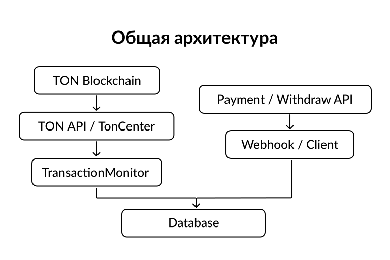
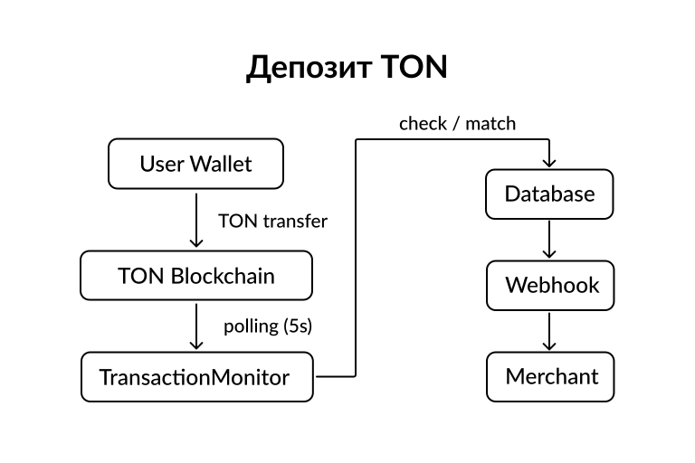
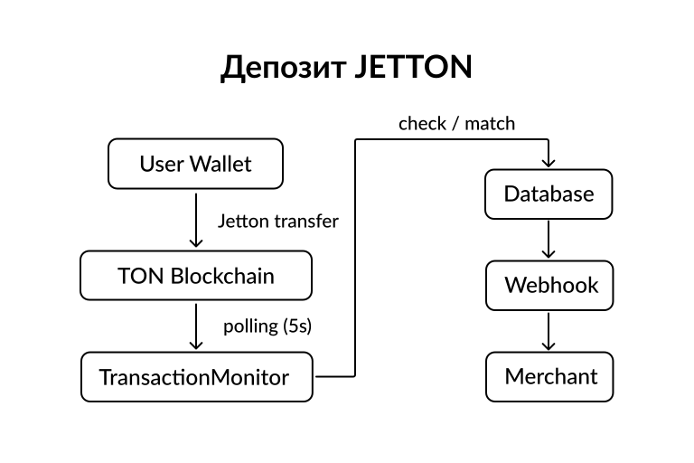
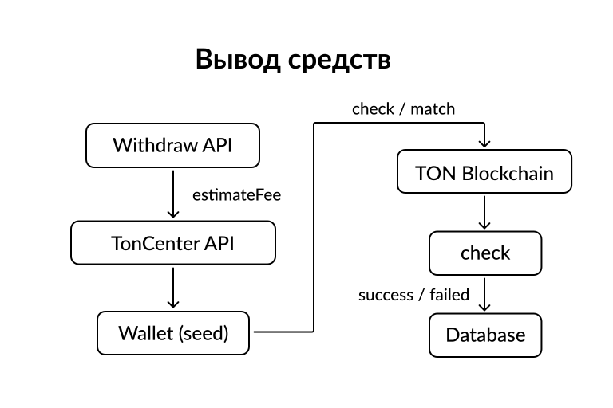

# TON Payment System

Платежная система для работы с блокчейном **TON (The Open Network)**, реализующая прием депозитов, автоматический мониторинг транзакций, обработку Jetton и TON переводов, а также безопасный вывод средств.

---

## Общий обзор

Система интегрирована с блокчейном TON и работает в режиме реального времени, постоянно отслеживая входящие и исходящие транзакции.

Основные функции:

* Мониторинг TON и Jetton транзакций
* Автоматическое сопоставление платежей
* Начисление балансов касс
* Безопасный вывод средств
* Webhook-уведомления
* Многоуровневая защита от атак и ошибок

Архитектура построена на связке:

* **PHP веб-интерфейс (TON-web)**
* **Python backend (TON)**
* **MySQL база данных**

---

## Архитектура работы с блокчейном

### Основные компоненты

* **TransactionMonitor** — мониторинг блокчейна TON
* **Payment API** — создание платежей и отправка webhook
* **Withdraw API** — вывод средств и расчет комиссий
* **Database layer** — обработка транзакций и балансов

Используемые API:

* TON API (`tonapi.io`)
* TonCenter API v2 / v3

---

## Мониторинг транзакций

### Принцип работы

* Polling блокчейна каждые 5 секунд
* Фильтрация транзакций по `Logical Time (LT)`
* Батч-обработка транзакций
* Сопоставление с ожидающими платежами в БД
* Обновление статусов и отправка webhook

### Поддерживаемые типы транзакций

#### TON

* Проверка успешности транзакции
* Проверка адреса получателя
* Округление суммы до 2 знаков вниз
* Сопоставление по адресу, сумме и времени

#### Jetton

* Обработка событий `JettonTransfer`
* Учет `decimals` контракта
* Фиксация комиссии
* Поддержка нескольких касс одного Jetton

---

## Статусы транзакций

### Депозиты

* `nohash` — создан, ожидание оплаты
* `pending` — транзакция найдена
* `success` — успешно обработан
* `duplicate` — дубликат
* `expired` — истек по времени
* `error` — ошибка обработки

### Вывод средств

* `pending`
* `success`
* `failed`

---

## Вывод средств

### TON переводы

* Расчет комиссии через `estimateFee`
* Учет всех фаз транзакции
* Добавление резерва
* Округление до 0.001 TON

### Jetton переводы

* Фиксированная комиссия: **0.1 TON**
* Комиссия списывается с TON баланса
* Используется `JettonMasterStandard` и `JettonWalletStandard`

---

## Безопасность

Система реализует многоуровневую модель безопасности.

### Основные меры защиты

* Защита от двойного списания
* Атомарные транзакции БД
* Rate limiting (PHP и Python)
* HMAC-подпись webhook
* CSRF защита
* SQL Injection защита (prepared statements)
* XSS защита
* SSRF защита
* Валидация адресов и сумм

### Аутентификация

* PHP сессии с защитой от фиксации
* API токены
* Ограничение попыток входа
* Защита от timing-атак

---

## Валидация и ограничения

* Минимальная сумма платежа: **0.01**
* Максимум 2 знака после точки
* Временное окно сопоставления: ±120 секунд
* Время жизни платежа: 20 минут
* Максимум 3 API запроса в секунду

---

## Производительность

* Обработка транзакции: ~1–3 секунды
* Задержка обнаружения: 5–10 секунд
* Использование батчинга и параллелизма
* Кеширование данных касс

---

## Визуальные схемы работы системы

В репозитории используются схемы, наглядно демонстрирующие ключевые процессы работы платежной системы.

### Общая архитектура системы

### Депозит TON

### Депозит Jetton

### Вывод средств

---

## Demo и контакты

### 🚀 Запущенный demo

Демонстрационная версия платежной системы доступна по адресу:

* **[https://pay.whaile.ru](https://pay.whaile.ru)**

### 👨‍💻 Разработчик

* **Telegram:** @whaile_dev
* **Website:** [https://whaile.ru](https://whaile.ru)

---

## Источники

Реализация расчета комиссий и переводов основана на:

* Официальной документации TON Foundation
* Документации по смарт-контрактам TON
* Практических статьях и GitHub issues
* Официальных примерах tonutils

Подробный список приведён в файле `SOURCES.md`.